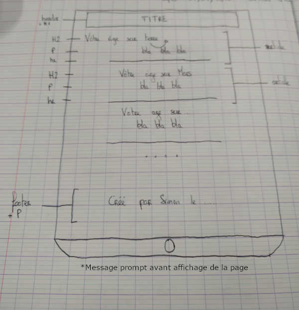

# SpaceDate
-----
Afficher son âge selon les planètes !
Challenge du 02/05/2019

## Consignes
* Créer un champs pour renseigner sa date de naissance
* Afficher son age sur :
    * Terre
    * Vénus
    * Mercure
    * Jupiter
    * Mars
    * Saturne
    * Pluton
    * (Uranus)
    * (Neptune)

## Maquette

## TODO
Tableau sur Trello avec les backlogs, TODO, WIP, Testing et Done.

[Trello](https://trello.com/b/CuBniXxe/spacedate)

## Quelques liens utiles

* Pour le JavaScript :
  * [Tous les prototypes de DATE](https://developer.mozilla.org/fr/docs/Web/JavaScript/Reference/Objets_globaux/Date/prototype)
  * [Fonction Date.now()](https://developer.mozilla.org/fr/docs/Web/JavaScript/Reference/Objets_globaux/Date/now)
  * [Generer un horodatage](https://www.journaldunet.fr/web-tech/developpement/1202533-comment-generer-un-timestamp-horodatage-en-javascript/)
  * [L'objet Date](https://developer.mozilla.org/fr/docs/Web/JavaScript/Reference/Objets_globaux/Date)
  * [L'objet Date (cours)](https://www.pierre-giraud.com/javascript/cours-complet/javascript-objet-date.php)
* Pour le PHP :
  * [Fonction date()](https://www.php.net/manual/fr/function.date.php)
  * [Le TIMESTAMP UNIX en PHP](https://www.pierre-giraud.com/php-mysql/cours-complet/php-timestamp-unix.php)
* Heures sur autres planètes :
  * [Une année sur Terre ou ailleurs](https://www.simplyscience.ch/archives-enfants/articles/une-annee-sur-terre-sur-mars-ou-sur-les-autres-planetes.html)
  * [Rotations révolutions](http://www.systemesolaire.net/rotation_revolution.html?i=2)